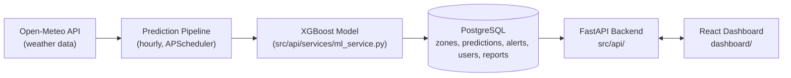

# NairobiFloodWatch

Real-time urban flash-flood prediction system for Nairobi County, Kenya —
a Strathmore University industry capstone project.

A trained XGBoost model classifies flood risk into four levels (**Low,
Moderate, High, Extreme**) across **8 Nairobi County zones**, using live
weather data. Predictions, alerts, and citizen reports are served through a
FastAPI backend to a React dashboard used by three kinds of users:

- **Citizens** — view current risk per zone and submit flood condition reports, no login required
- **Authorities (officers)** — monitor the live risk map, manage and acknowledge alerts
- **System administrators** — manage user accounts, alert thresholds, and review model performance

## Architecture



## Repository structure

```
Predictive-Flood-Modelling-System/
├── dashboard/        React + Vite frontend (citizen, officer, and admin views)
├── src/
│   ├── api/          FastAPI backend (routers, services, models, utils)
│   └── scripts/      init_db.py, run_pipeline.py
├── models/           Trained XGBoost model + scaler + feature columns (.joblib)
├── data/             Raw/processed data used for model training
├── notebooks/        Model training & evaluation notebook (FloodHub.ipynb)
├── tests/            Backend API smoke tests (pytest)
├── requirements.txt  Backend Python dependencies
└── .env.example      Backend environment variable template
```

## Quick start

Two independent apps make up the system — run them side by side during development.

### 1. Backend (FastAPI + PostgreSQL)

Install dependencies:

```
pip install -r requirements.txt
```

Set up PostgreSQL:

```
createdb nairobifloodwatch
```

or via `psql`:

```sql
CREATE DATABASE nairobifloodwatch;
```

Copy the environment file and edit it with your DB password and secret key:

```
cp .env.example .env
```

Generate a secret key (minimum 32 characters):

```
python -c "import secrets; print(secrets.token_hex(32))"
```

Initialise the database and seed zones/users/initial predictions:

```
python -m src.scripts.init_db
```

Start the API server:

```
uvicorn src.api.main:app --reload --port 8000
```

Access the API docs:

- Swagger UI: http://localhost:8000/docs
- ReDoc: http://localhost:8000/redoc

Run tests (requires the seeded database above):

```
pytest tests/ -v
```

Run the prediction pipeline manually:

```
python -m src.scripts.run_pipeline
```

To use your own trained model, drop these three files into `models/` (see
`MODEL_PATH`/`SCALER_PATH`/`FEATURE_COLS_PATH` in `.env` if you rename them),
then restart the server:

```
models/flood_model_final.joblib
models/scaler_final.joblib
models/feature_cols_final.joblib
```

### 2. Frontend (React dashboard)

```
cd dashboard
npm install
npm start
```

The dashboard runs at http://localhost:5173 with routes `/` (public map),
`/citizen`, `/login`, `/officer`, `/officer/alerts`, and `/admin`.

## Default credentials (seeded by init_db)

| Role    | Email              | Password    |
|---------|--------------------|-------------|
| admin   | admin@flood.ke     | admin123    |
| officer | officer@flood.ke   | officer123  |

## Notes

- If `models/flood_model_final.joblib` (and its scaler/feature-columns
  companions) are missing, the API still starts — `MLService` falls back
  to mock "Moderate" predictions and logs a warning.
- The hourly prediction pipeline uses county-level Open-Meteo weather data
  applied identically to all 8 zones; zone differentiation is baked into
  the model via terrain features used at training time.
- Model performance (test set 2024–2026): AUC-ROC 0.8732, weighted recall
  0.7880. Moderate/High recall are below target due to training data
  scarcity — expected to improve with TAHMO ground station integration.
